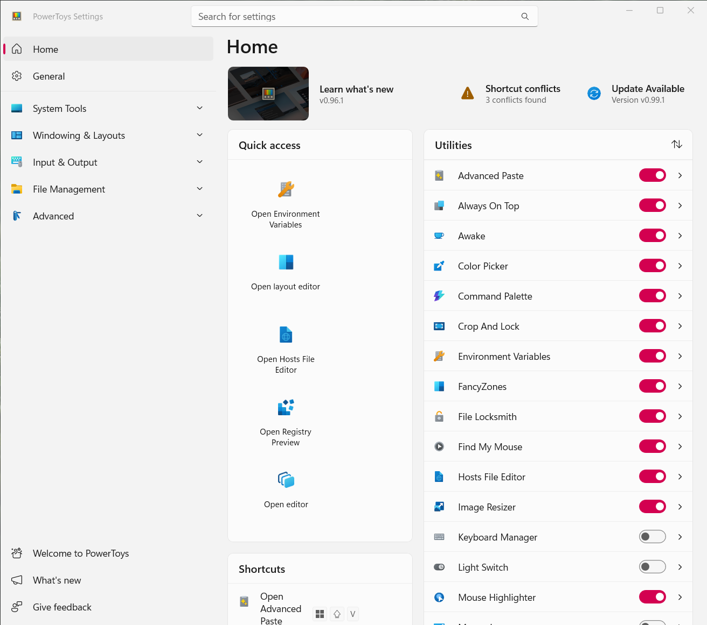

*Copyright &copy; 2026 Gage Sorrell.  Released under the [MIT license](./License.md).*

# `@sorrellwm/settings/ui`

**Purpose.**&ensp;A Fluent-UI—based component library for viewing and editing application settings.

This is heavily inspired by the settings screen of [Microsoft PowerToys](https://github.com/microsoft/powertoys).

    
    
The Microsoft PowerToys settings window.  The rounded corners provided by Windows 11 have been removed via a third-party utility.

